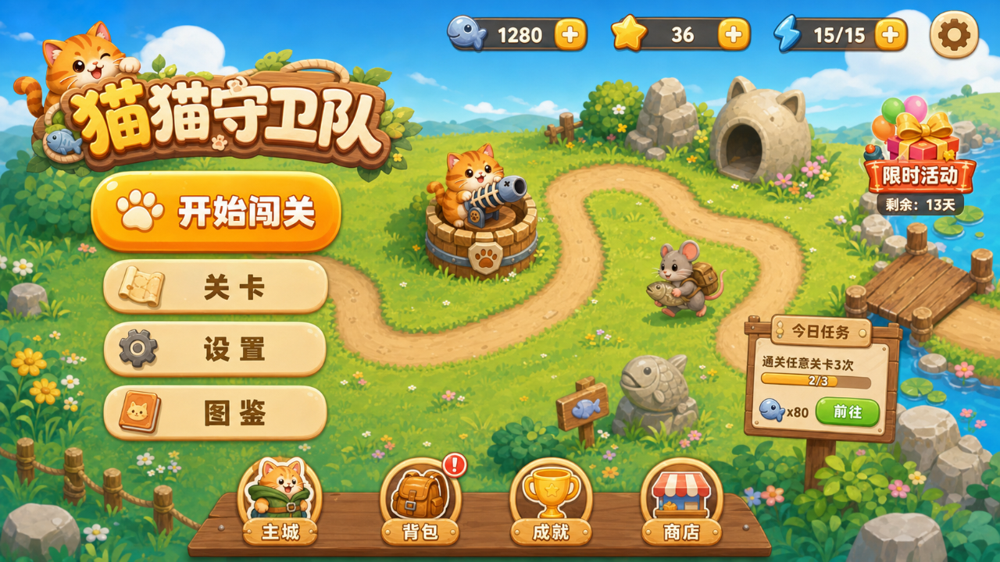
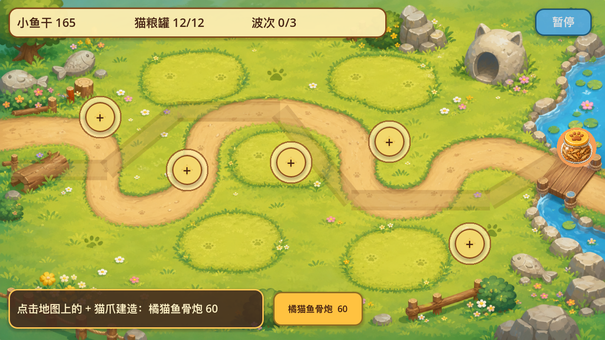
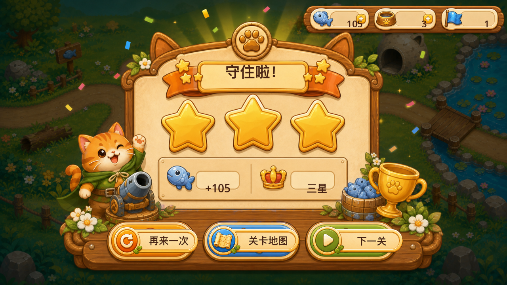
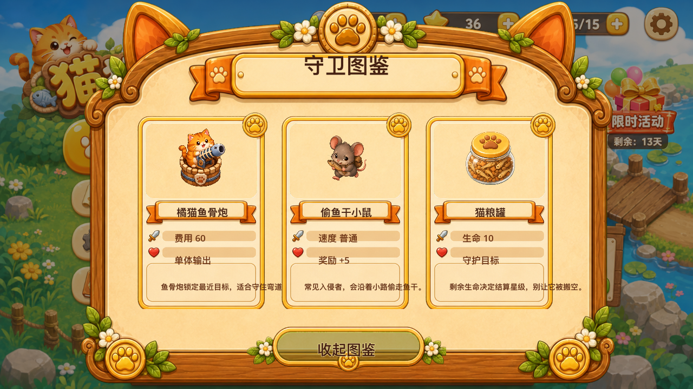
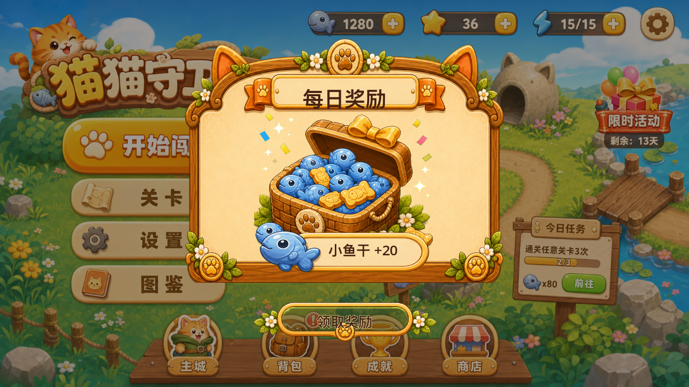

# MeowDefense

一款 Godot 4 制作的猫猫塔防原型。玩家守住猫粮罐，在 5 个关卡里布置猫塔，拦截偷鱼干的小鼠队伍。



## 功能

- 5 个可通关关卡，配置位于 `data/levels/`
- Image2 生成并分类整理的背景、塔、敌人、基地和 UI 素材
- Image2 高保真主菜单、关卡、战斗 HUD、暂停、设置、结果页、图鉴和奖励弹窗设计稿/素材作为实际 UI 视觉来源，交互使用透明热区覆盖
- 橘猫鱼骨炮和狸花毛线塔两种塔
- 普通鼠、快跑仓鼠、罐头胖鼠、冲刺仓鼠四种敌人
- 敌人、塔、基地都有运行时动画反馈
- 明确的地图 `+` 建造按钮，支持真实玩家点击建塔

## 运行

需要 Godot 4.6 或更新版本。

```bash
/Users/zhaok/Downloads/Godot.app/Contents/MacOS/Godot --path /Users/zhaok/cat
```

如果克隆到其他目录，也可以用：

```bash
Godot --path /path/to/MeowDefense
```

进入游戏后：

1. 点击 `开始闯关`
2. 选择关卡并点击 `出发`
3. 在战斗地图上点击黄色圆形 `+` 猫爪按钮建造猫塔
4. 第二关开始可在底部切换塔类型

## 测试

```bash
/Users/zhaok/Downloads/Godot.app/Contents/MacOS/Godot --headless --path /Users/zhaok/cat --script tests/run_campaign_tests.gd
/Users/zhaok/Downloads/Godot.app/Contents/MacOS/Godot --headless --path /Users/zhaok/cat --script tests/run_playthrough_tests.gd
/Users/zhaok/Downloads/Godot.app/Contents/MacOS/Godot --headless --path /Users/zhaok/cat --script tests/run_menu_tests.gd
/Users/zhaok/Downloads/Godot.app/Contents/MacOS/Godot --headless --path /Users/zhaok/cat --script tests/run_album_overlay_tests.gd
/Users/zhaok/Downloads/Godot.app/Contents/MacOS/Godot --headless --path /Users/zhaok/cat --script tests/run_reward_overlay_tests.gd
/Users/zhaok/Downloads/Godot.app/Contents/MacOS/Godot --headless --path /Users/zhaok/cat --script tests/run_build_input_tests.gd
/Users/zhaok/Downloads/Godot.app/Contents/MacOS/Godot --headless --path /Users/zhaok/cat --script tests/run_pause_menu_tests.gd
/Users/zhaok/Downloads/Godot.app/Contents/MacOS/Godot --headless --path /Users/zhaok/cat --script tests/run_result_screen_tests.gd
/Users/zhaok/Downloads/Godot.app/Contents/MacOS/Godot --headless --path /Users/zhaok/cat --script tests/run_scene_smoke.gd
/Users/zhaok/Downloads/Godot.app/Contents/MacOS/Godot --headless --path /Users/zhaok/cat --script tests/run_unit_tests.gd
```

## 素材

最终项目素材位于 `assets/generated/`：

- `backgrounds/`: 5 张关卡背景
- `towers/`: 猫塔素材
- `enemies/`: 敌人素材
- `bases/`: 猫粮罐基地
- `ui/`: 主菜单、关卡、战斗 HUD、暂停、设置、结果页、图鉴、奖励弹窗设计稿和关卡缩略图

完整清单见 `assets/generated/assets_manifest.json` 和 `artifacts/campaign_asset_inventory.md`。

## 截图









