# MeowDefense

一款 Godot 4 制作的猫猫塔防原型。玩家守住猫粮罐，在 5 个关卡里布置猫塔，拦截偷鱼干的小鼠队伍。


## 功能

- 5 个可通关关卡，配置位于 `data/levels/`
- Image2 生成并分类整理的背景、塔、敌人、基地和 UI 素材
- Image2 高保真主菜单、关卡、战斗 HUD、暂停、设置、胜利/失败结果页、图鉴、奖励、背包、成就和商店设计稿/素材作为实际 UI 视觉来源，交互使用透明热区覆盖
- 橘猫鱼骨炮和狸花毛线塔两种塔
- 普通鼠、快跑仓鼠、罐头胖鼠、冲刺仓鼠四种敌人
- 图鉴卡片可点击打开 Image2 详情页，并可从详情页前往关卡
- 敌人、塔、基地都有运行时动画反馈
- 明确的地图 `+` 建造按钮，支持真实玩家点击建塔
- 已建猫塔可点击打开 Image2 管理面板，支持升级和出售返还鱼干
- 战斗 HUD 支持下一波敌人预告和 1x/2x 加速切换
- 胜利结果页带有 Image2 星星和鱼干奖励脉冲动效，失败页不会播放胜利奖励反馈
- 首页每日奖励按真实日期重置，支持连续领取天数和同日防重复领取
- 首页今日任务现在是独立 Image2 弹窗，可按通关、星级和毛线陷阱进度领取小鱼干奖励
- 成就页可按进度领取小鱼干和猫爪徽章，背包会显示徽章数量
- 背包物品可点击打开 Image2 详情卡，并可从毛线陷阱详情直接前往关卡
- 背包整理会弹出 Image2 奖励反馈，并一次性发放小鱼干
- 商店可购买猫爪徽章包和毛线陷阱包，背包会显示持有数量
- 战斗中可使用背包里的毛线陷阱减速小鼠，并带有 Image2 毛线缠绕特效
- 关卡解锁、最佳星级、小鱼干、猫爪徽章、毛线陷阱和奖励领取状态会持久化保存

## 运行

需要 Godot 4.6 或更新版本。

```bash
/Users/zhaok/Downloads/Godot.app/Contents/MacOS/Godot --path /Users/zhaok/cat
```

如果克隆到其他目录，也可以用：

```bash
Godot --path /path/to/MeowDefense
```

进入游戏后：

1. 点击 `开始闯关`
2. 选择关卡并点击 `出发`
3. 在战斗地图上点击黄色圆形 `+` 猫爪按钮建造猫塔
4. 第二关开始可在底部切换塔类型
5. 在商店购买毛线陷阱后，可在战斗右下角点击道具图标减速敌人
6. 通关后会解锁下一关，并保留星级和小鱼干进度

## 测试

```bash
/Users/zhaok/Downloads/Godot.app/Contents/MacOS/Godot --headless --path /Users/zhaok/cat --script tests/run_campaign_tests.gd
/Users/zhaok/Downloads/Godot.app/Contents/MacOS/Godot --headless --path /Users/zhaok/cat --script tests/run_playthrough_tests.gd
/Users/zhaok/Downloads/Godot.app/Contents/MacOS/Godot --headless --path /Users/zhaok/cat --script tests/run_menu_tests.gd
/Users/zhaok/Downloads/Godot.app/Contents/MacOS/Godot --headless --path /Users/zhaok/cat --script tests/run_album_overlay_tests.gd
/Users/zhaok/Downloads/Godot.app/Contents/MacOS/Godot --headless --path /Users/zhaok/cat --script tests/run_album_entry_detail_tests.gd
/Users/zhaok/Downloads/Godot.app/Contents/MacOS/Godot --headless --path /Users/zhaok/cat --script tests/run_reward_overlay_tests.gd
/Users/zhaok/Downloads/Godot.app/Contents/MacOS/Godot --headless --path /Users/zhaok/cat --script tests/run_daily_reward_reset_tests.gd
/Users/zhaok/Downloads/Godot.app/Contents/MacOS/Godot --headless --path /Users/zhaok/cat --script tests/run_daily_task_overlay_tests.gd
/Users/zhaok/Downloads/Godot.app/Contents/MacOS/Godot --headless --path /Users/zhaok/cat --script tests/run_town_feature_overlay_tests.gd
/Users/zhaok/Downloads/Godot.app/Contents/MacOS/Godot --headless --path /Users/zhaok/cat --script tests/run_backpack_item_detail_tests.gd
/Users/zhaok/Downloads/Godot.app/Contents/MacOS/Godot --headless --path /Users/zhaok/cat --script tests/run_backpack_organize_reward_tests.gd
/Users/zhaok/Downloads/Godot.app/Contents/MacOS/Godot --headless --path /Users/zhaok/cat --script tests/run_achievement_claim_tests.gd
/Users/zhaok/Downloads/Godot.app/Contents/MacOS/Godot --headless --path /Users/zhaok/cat --script tests/run_shop_yarn_trap_tests.gd
/Users/zhaok/Downloads/Godot.app/Contents/MacOS/Godot --headless --path /Users/zhaok/cat --script tests/run_shop_paw_bundle_tests.gd
/Users/zhaok/Downloads/Godot.app/Contents/MacOS/Godot --headless --path /Users/zhaok/cat --script tests/run_battle_yarn_trap_tests.gd
/Users/zhaok/Downloads/Godot.app/Contents/MacOS/Godot --headless --path /Users/zhaok/cat --script tests/run_battle_yarn_inventory_flow_tests.gd
/Users/zhaok/Downloads/Godot.app/Contents/MacOS/Godot --headless --path /Users/zhaok/cat --script tests/run_build_input_tests.gd
/Users/zhaok/Downloads/Godot.app/Contents/MacOS/Godot --headless --path /Users/zhaok/cat --script tests/run_tower_action_tests.gd
/Users/zhaok/Downloads/Godot.app/Contents/MacOS/Godot --headless --path /Users/zhaok/cat --script tests/run_battle_speed_wave_tests.gd
/Users/zhaok/Downloads/Godot.app/Contents/MacOS/Godot --headless --path /Users/zhaok/cat --script tests/run_progression_persistence_tests.gd
/Users/zhaok/Downloads/Godot.app/Contents/MacOS/Godot --headless --path /Users/zhaok/cat --script tests/run_pause_menu_tests.gd
/Users/zhaok/Downloads/Godot.app/Contents/MacOS/Godot --headless --path /Users/zhaok/cat --script tests/run_result_screen_tests.gd
/Users/zhaok/Downloads/Godot.app/Contents/MacOS/Godot --headless --path /Users/zhaok/cat --script tests/run_result_defeat_screen_tests.gd
/Users/zhaok/Downloads/Godot.app/Contents/MacOS/Godot --headless --path /Users/zhaok/cat --script tests/run_scene_smoke.gd
/Users/zhaok/Downloads/Godot.app/Contents/MacOS/Godot --headless --path /Users/zhaok/cat --script tests/run_unit_tests.gd
```

## 素材

最终项目素材位于 `assets/generated/`：

- `backgrounds/`: 5 张关卡背景
- `towers/`: 猫塔素材
- `enemies/`: 敌人素材
- `bases/`: 猫粮罐基地
- `ui/`: 主菜单、关卡、锁定徽章、战斗 HUD、暂停、设置、胜利/失败结果页、图鉴、奖励、今日任务、背包、成就、商店弹窗设计稿和关卡缩略图

完整清单见 `assets/generated/assets_manifest.json` 和 `artifacts/campaign_asset_inventory.md`。

## 截图


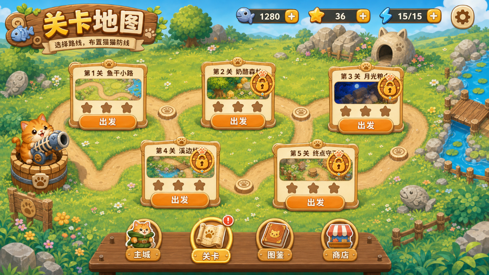


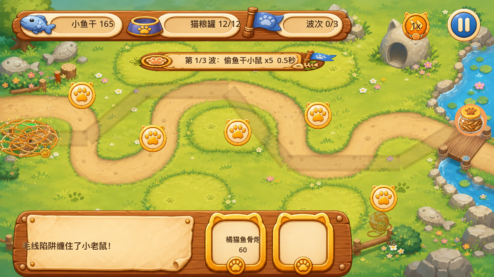

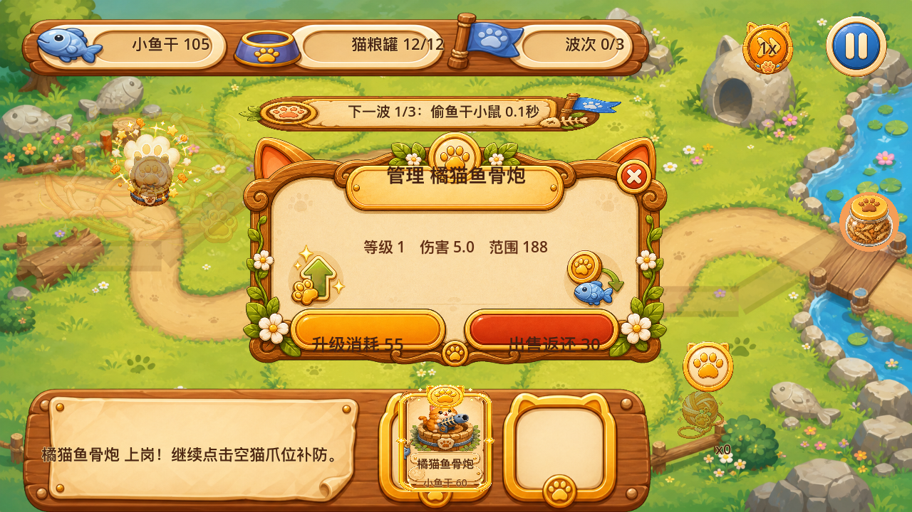

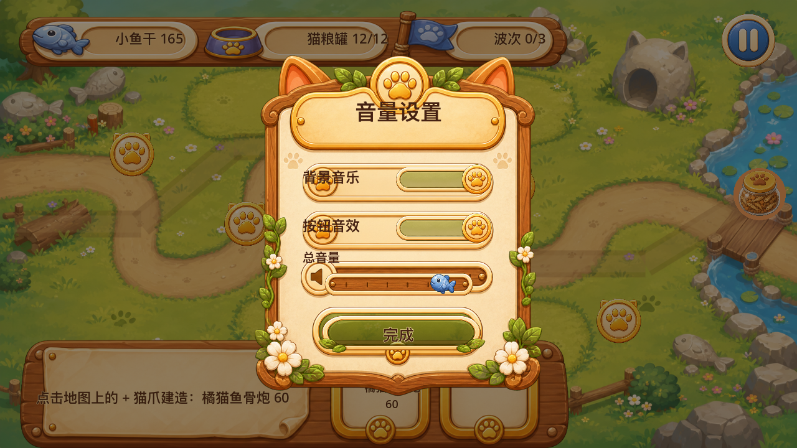


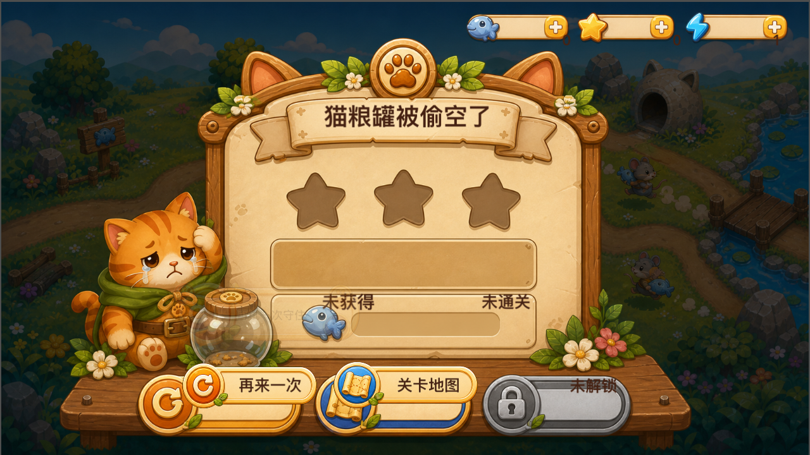


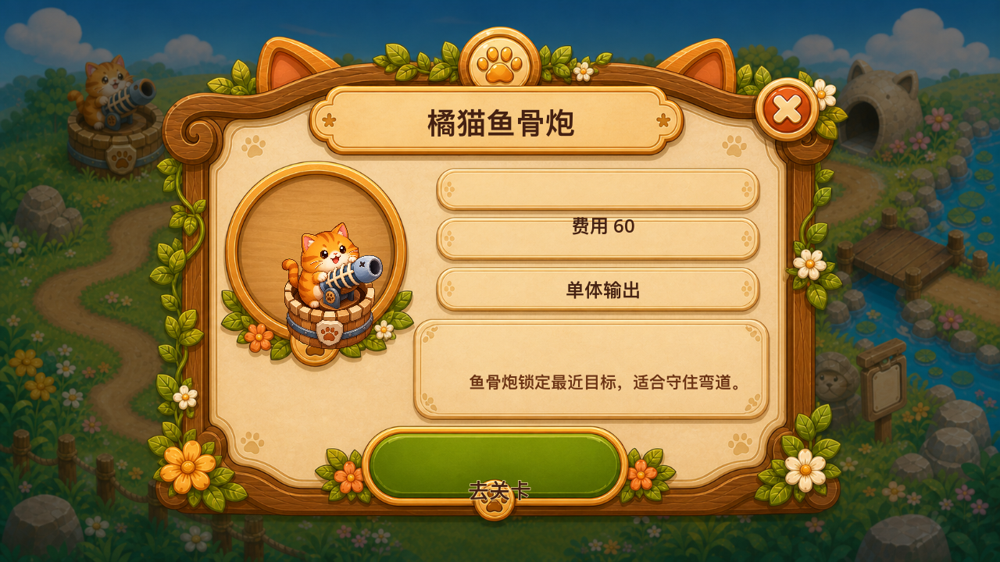


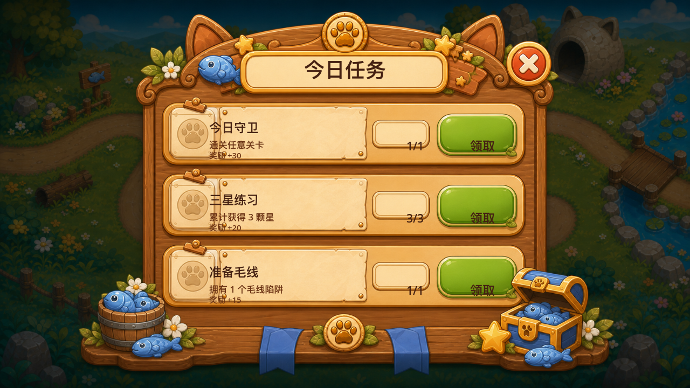

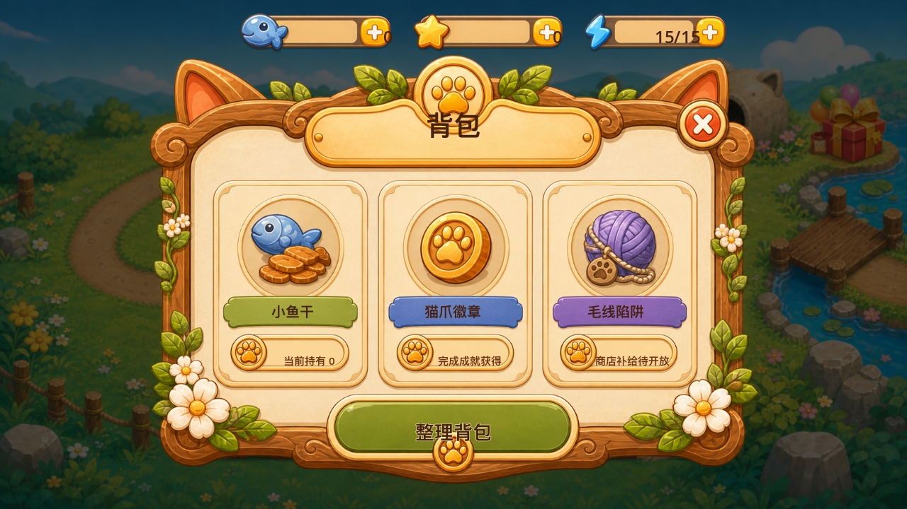

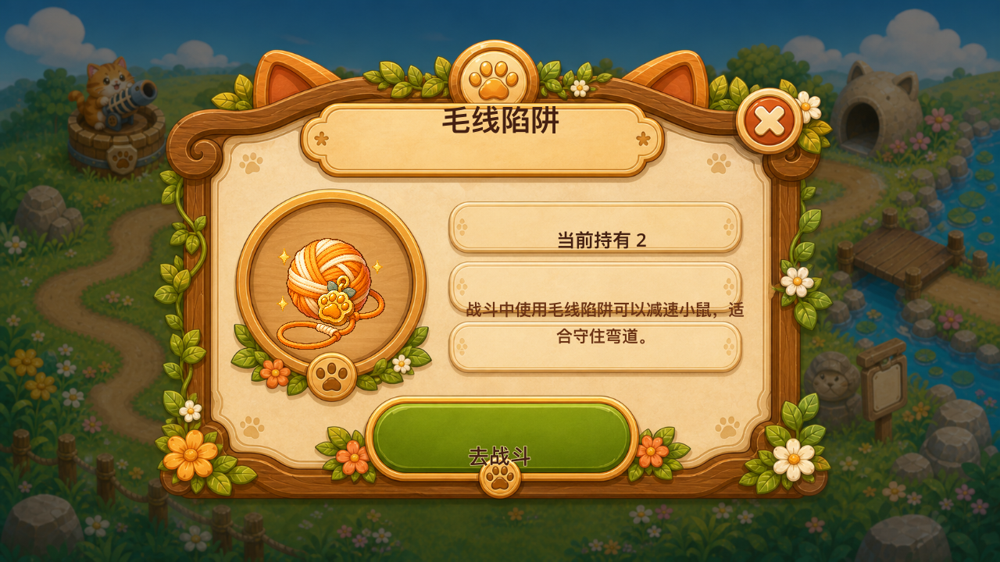

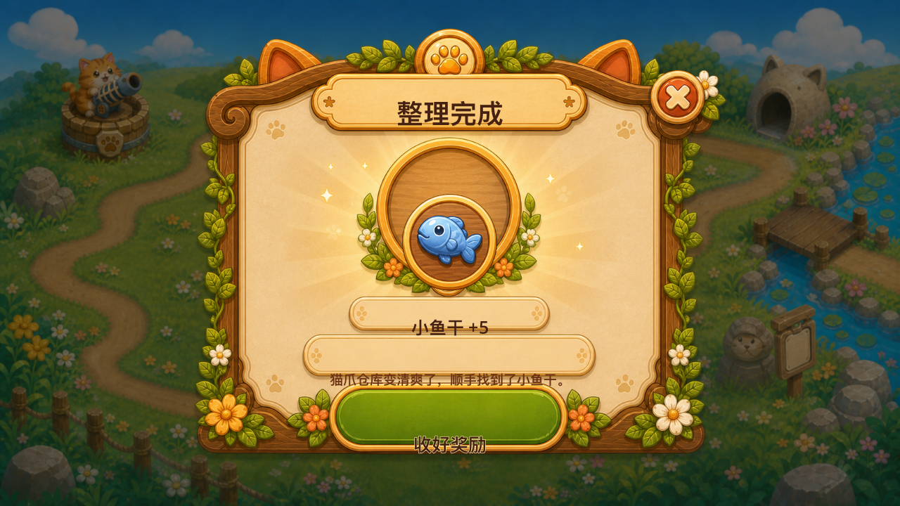


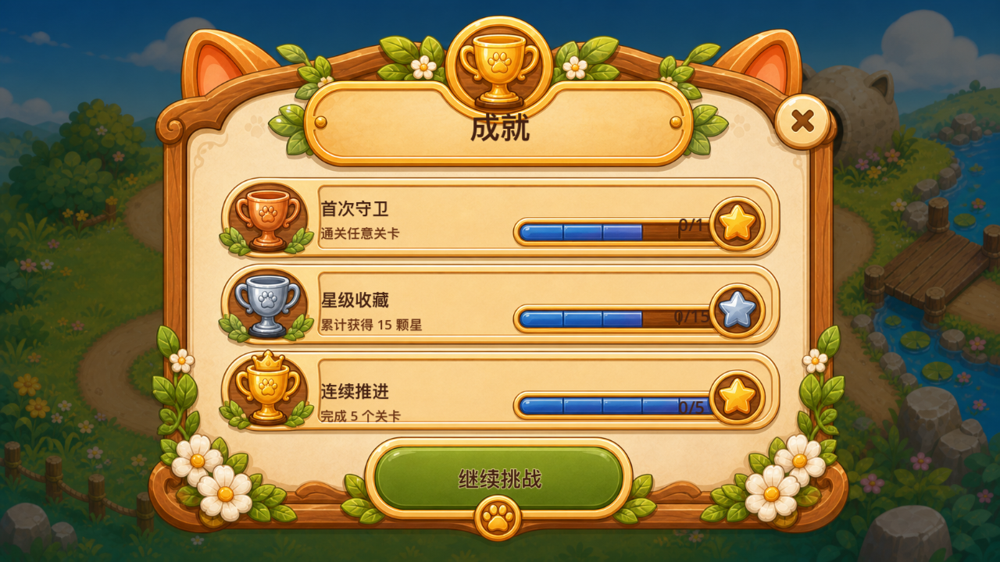

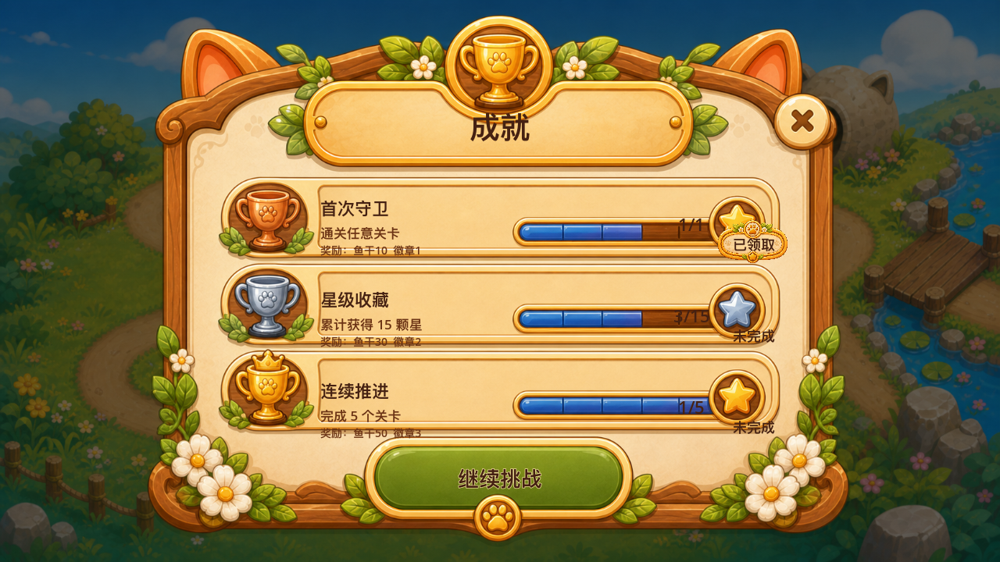


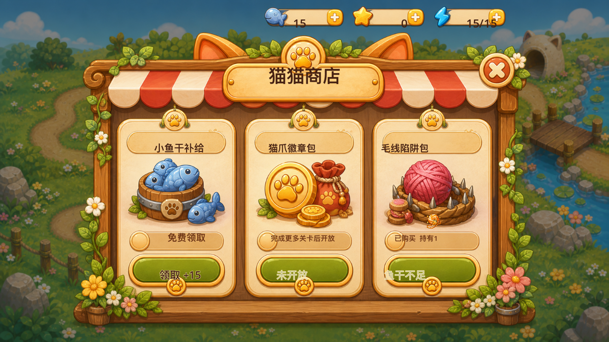
